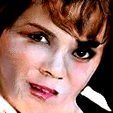
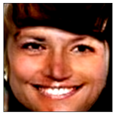
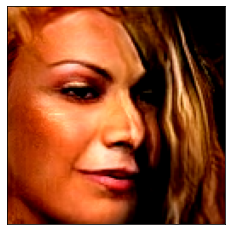
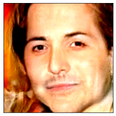
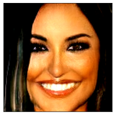
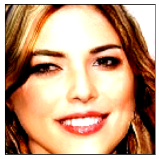
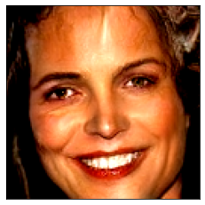

# CelebA-ProGAN
Progressive GAN on celebrity faces (<a href="https://colab.research.google.com/drive/1jJSvIb0ShUrpKcis66MurtWwKEDUd8Xs" target="_blank">Notebook</a>)
### (**NOTE:** It is most reccomended to view the notebook on <a href="https://colab.research.google.com/drive/1jJSvIb0ShUrpKcis66MurtWwKEDUd8Xs" target="_blank">Colab</a> as I keep it the most up to date)

# **ALL OF THE IMAGES GIVEN BELOW WERE GENERATED BY THE COMPUTER MODEL**

 

  

  

  


## To run:
```python
python generate_face.py
```
